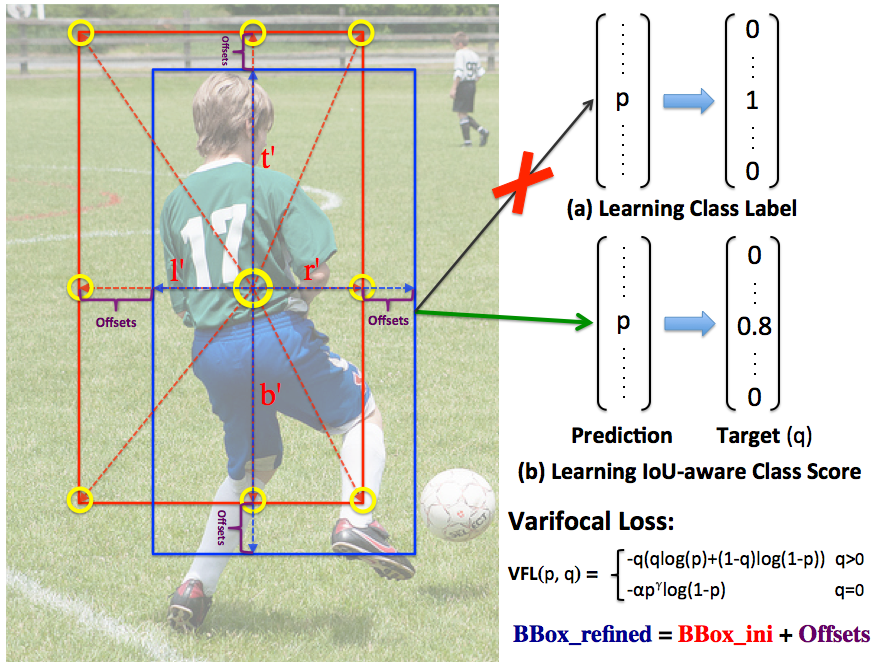

# VarifocalNet: An IoU-aware Dense Object Detector

This repo hosts the code for implementing the VarifocalNet, as presented in our CVPR 2021 oral paper, which is available at: [https://arxiv.org/abs/2008.13367](https://arxiv.org/abs/2008.13367):

```
@inproceedings{zhang2020varifocalnet,
  title={VarifocalNet: An IoU-aware Dense Object Detector},
  author={Zhang, Haoyang and Wang, Ying and Dayoub, Feras and S{\"u}nderhauf, Niko},
  booktitle={CVPR},
  year={2021}
}
```

## Introduction

Accurately ranking the vast number of candidate detections is crucial for dense object detectors to achieve high performance. In this work, we propose to learn IoU-aware classification scores (**IACS**) that simultaneously represent the object presence confidence and localization accuracy, to produce a more accurate ranking of detections in dense object detectors. In particular, we design a new loss function, named **Varifocal Loss (VFL)**, for training a dense object detector to predict the IACS, and a new efficient star-shaped bounding box feature representation (the features at nine yellow sampling points) for estimating the IACS and refining coarse bounding boxes. Combining these two new components and a bounding box refinement branch, we build a new IoU-aware dense object detector based on the FCOS+ATSS architecture, what we call **VarifocalNet** or **VFNet** for short. Extensive experiments on MS COCO benchmark show that our VFNet consistently surpasses the strong baseline by ~2.0 AP with different backbones. Our best model VFNet-X-1200 with Res2Net-101-DCN reaches a single-model single-scale AP of **55.1** on COCO `test-dev`, achieving the state-of-the-art performance among various object detectors.

<div align="center">
  
  <p>Learning to Predict the IoU-aware Classification Score.</p>
</div>

## Updates

- **2021.03.05** Our VarifocalNet is accepted to CVPR 2021 as an oral presentation. Thanks the reviewers and ACs.
- **2021.03.04** Update to MMDetection v2.10.0, add more results and [training scripts](configs/atss), and update [the arXiv paper](https://arxiv.org/abs/2008.13367).
- **2021.01.09** Add SWA training.
- **2021.01.07** Update to MMDetection v2.8.0.
- **2020.12.24** We release a new VFNet-X model that can achieve a single-model single-scale **55.1 AP** on COCO test-dev at 4.2 FPS.
- **2020.12.02** Update to MMDetection v2.7.0.
- **2020.10.29** VarifocalNet has been merged into [the official MMDetection repo](https://github.com/open-mmlab/mmdetection/tree/master/configs/vfnet). Many thanks to [@yhcao6](https://github.com/yhcao6), [@RyanXLi](https://github.com/RyanXLi) and [@hellock](https://github.com/hellock)!
- **2020.10.29** This repo has been refactored so that users can pull the latest updates from the upstream official MMDetection repo. The previous one can be found in the `old` branch.

## Installation

- This VarifocalNet implementation is based on [MMDetection](https://github.com/open-mmlab/mmdetection). Therefore the installation is the same as original MMDetection.

- Please check [get_started.md](docs/get_started.md) for installation. Note that you should change the version of PyTorch and CUDA to yours when installing **mmcv** in `step 3` and clone this repo instead of MMdetection in `step 4`.

- If you run into problems with `pycocotools`, please install it by:

  ```
  pip install "git+https://github.com/open-mmlab/cocoapi.git#subdirectory=pycocotools"
  ```

## A Quick Demo

Once the installation is done, you can follow the steps below to run a quick demo.

- Download the [model](https://drive.google.com/file/d/1aF3Fi5rYeMqSC3Ndo4VEqjPXk4fcOfjt/view?usp=sharing) and put it into one folder under the root directory of this project, say, `checkpoints/`.
- Go to the root directory of this project in terminal and activate the corresponding virtual environment.
- Run

  ```
  python demo/image_demo.py demo/demo.jpg configs/vfnet/vfnet_r50_fpn_1x_coco.py checkpoints/vfnet_r50_1x_41.6.pth
  ```

  and you should see an image with detections.

## Usage of MMDetection

Please see [exist_data_model.md](docs/1_exist_data_model.md) for the basic usage of MMDetection.
They also provide [colab tutorial](demo/MMDet_Tutorial.ipynb) for beginners.

For troubleshooting, please refer to [faq.md](docs/faq.md)

## Results and Models

For your convenience, we provide the following trained models. These models are trained with a mini-batch size of 16 images on 8 Nvidia V100 GPUs (2 images per GPU).

| Backbone     | Style     | DCN     | MS <br> train | Lr <br> schd |Inf time <br> (fps) | box AP <br> (val) | box AP <br> (test-dev) | &nbsp; &nbsp; Download  &nbsp; &nbsp;  |
|:------------:|:---------:|:-------:|:-------------:|:------------:|:------------------:|:-----------------:|:----------------------:|:--------------------------------------:|
| R-50         | pytorch   | N       | N             | 1x           | 19.4               | 41.6              | 41.6                   | [model](https://drive.google.com/file/d/1aF3Fi5rYeMqSC3Ndo4VEqjPXk4fcOfjt/view?usp=sharing) &#124; [log](https://drive.google.com/file/d/16tufMtxWI5Zq2Bx9VNt57Fxt8VnlBmnR/view?usp=sharing)|
| R-50         | pytorch   | N       | Y             | 2x           | 19.3               | 44.5              | 44.8                   | [model](https://drive.google.com/file/d/1oAUu7zGZmPni0XZu8XJMDWR5GJi_pwYz/view?usp=sharing) &#124; [log](https://drive.google.com/file/d/1sFlRVMyTGcZBmnMxx1T_ulNHTC_JoynF/view?usp=sharing)|
| R-50         | pytorch   | Y       | Y             | 2x           | 16.3               | 47.8              | 48.0                   | [model](https://drive.google.com/file/d/16rk1pCPmQOj98GkpM-y3IPBpdKcfq0I4/view?usp=sharing) &#124; [log](https://drive.google.com/file/d/1pcOW7CjJYz0XHRkZKi_TjoD4hj4mz6DP/view?usp=sharing)|
| R-101        | pytorch   | N       | N             | 1x           | 15.5               | 43.0              | 43.6                   | [model](https://drive.google.com/file/d/1z76RBD6fI43IQn2tGuSJ5KonuJE49Nfk/view?usp=sharing) &#124; [log](https://drive.google.com/file/d/1ASitqJL2puajfpFVQv04VVKWSvkWqIKq/view?usp=sharing)|
| R-101        | pytorch   | N       | N             | 2x           | 15.6               | 43.5              | 43.9                   | [model](https://drive.google.com/file/d/1SXYCfkOXXGBhvURcqH23DA5gIwSFYz2u/view?usp=sharing) &#124; [log](https://drive.google.com/file/d/1abueLX2H4R-zr5kMw1WDbzf4wSQ2my3_/view?usp=sharing)|
| R-101        | pytorch   | N       | Y             | 2x           | 15.6               | 46.2              | 46.7                   | [model](https://drive.google.com/file/d/1ioQ2Fdbp4OS2Oi6g7no6fqU2-V8TtOTz/view?usp=sharing) &#124; [log](https://drive.google.com/file/d/1XA9_xH0TmOJgsbAQ05MV1AdcS6AkKvfz/view?usp=sharing)|
| R-101        | pytorch   | Y       | Y             | 2x           | 12.6               | 49.0              | 49.2                   | [model](https://drive.google.com/file/d/1W-Wkl3e3f64PzP8vJ0iB5svMqNlOzPyI/view?usp=sharing) &#124; [log](https://drive.google.com/file/d/1qvKopNIXZsexEMBXP7TA_agxw-qul6id/view?usp=sharing)|
| X-101-32x4d  | pytorch   | N       | Y             | 2x           | 13.1               | 47.4              | 47.6                   | [model](https://drive.google.com/file/d/1X-soI6dyFxv0jWOKxthPPsVeyqIRRa-F/view?usp=sharing) &#124; [log](https://drive.google.com/file/d/1ywK17-fJYWqTabl8NE-JOFKhk6ihXy25/view?usp=sharing)|
| X-101-32x4d  | pytorch   | Y       | Y             | 2x           | 10.1               | 49.7              | 50.0                   | [model](https://drive.google.com/file/d/1QtMyI4tjccigDPn2A-V1sQuK-Z6eTHwq/view?usp=sharing) &#124; [log](https://drive.google.com/file/d/1OqEIS4wnBdkSLTVn2mLhyOEef0yuNZyg/view?usp=sharing)|
| X-101-64x4d  | pytorch   | N       | Y             | 2x           |  9.2               | 48.2              | 48.5                   | [model](https://drive.google.com/file/d/1m0BQ6XyAlxNdJQVbg_4OuEgEctywPVx9/view?usp=sharing) &#124; [log](https://drive.google.com/file/d/1DFgBSzWyIaPo7UZsY2oRhxq1-W0gre8Z/view?usp=sharing)|
| X-101-64x4d  | pytorch   | Y       | Y             | 2x           |  6.7               | 50.4              | 50.8                   | [model](https://drive.google.com/file/d/1GkyJirn8J10TTyWiyw5C4boKWlW9epSU/view?usp=sharing) &#124; [log](https://drive.google.com/file/d/1ZPPiX1KhT6D48OPSOnPPGa9NqPa4HePG/view?usp=sharing)|
| R2-101       | pytorch   | N       | Y             | 2x           | 13.0               | 49.2              | 49.3                   | [model](https://drive.google.com/file/d/1E4o1CxaWUQV7-HAyqbITw7JD8mOF7tNW/view?usp=sharing) &#124; [log](https://drive.google.com/file/d/1ESnWn7nXRJVcqQb5OjH3c6XM8Rqc4shI/view?usp=sharing)|
| R2-101       | pytorch   | Y       | Y             | 2x           | 10.3               | 51.1              | 51.3                   | [model](https://drive.google.com/file/d/1kCiEqAA_VQlhbiNuZ3HWGhBD1JvVpK0c/view?usp=sharing) &#124; [log](https://drive.google.com/file/d/1BTwm-knCIT-kzkASjWNMfRWaAwI0ONmC/view?usp=sharing)|

**Notes:**

- The MS-train maximum scale range is 1333x[480:960] (`range` mode) and the inference scale keeps 1333x800.
- The R2-101 backbone is [Res2Net-101](https://github.com/Res2Net/mmdetection).
- DCN means using `DCNv2` in both backbone and head.
- The inference speed is tested with an Nvidia V100 GPU on HPC ([log file](https://drive.google.com/file/d/1dc9296G6JevouLixj-g81VgccEt54ceP/view?usp=sharing)).

We also provide the models of RetinaNet, FoveaBox, RepPoints and ATSS trained with the Focal Loss (FL) and our Varifocal Loss (VFL).

| Method          | Backbone | MS train | Lr schd | box AP (val) | Download |
|:---------------:|:--------:|:--------:|:-------:|:------------:|:--------:|
| RetinaNet + FL  | R-50     | N        | 1x      | 36.5         | [model](https://drive.google.com/file/d/1jvz6f6_uhiFoulW3qP3aN1P142jRJgky/view?usp=sharing) &#124; [log](https://drive.google.com/file/d/15KzsNNurMnBiPIbzifNhmzxRHgbJwbtZ/view?usp=sharing) |
| RetinaNet + VFL | R-50     | N        | 1x      | 37.4         | [model](https://drive.google.com/file/d/1FuWtTdr-NlcqVJW35lhlicCk2hmtIip8/view?usp=sharing) &#124; [log](https://drive.google.com/file/d/16QnRZKJmofil75Ua7uANkqwpJzQ6oh1I/view?usp=sharing) |
| FoveaBox + FL   | R-50     | N        | 1x      | 36.3         | [model](https://drive.google.com/file/d/1NG9ovPa9qVUZ6uFeJct3I7koQGBwvQ_b/view?usp=sharing) &#124; [log](https://drive.google.com/file/d/15LP3A7oIte4ofgqWGePLx9bbu4FzIZK3/view?usp=sharing) |
| FoveaBox + VFL  | R-50     | N        | 1x      | 37.2         | [model](https://drive.google.com/file/d/1mS9guZmgPeZj-Sgo0HLE5B881pdT2PyJ/view?usp=sharing) &#124; [log](https://drive.google.com/file/d/1dcAUFHQTJJ6UWr0fcLRju87cIagUQtfM/view?usp=sharing) |
| RepPoints + FL  | R-50     | N        | 1x      | 38.3         | [model](https://drive.google.com/file/d/1qpH5gGmI_x5EkT5gc0uwK3gTjPG6vzp2/view?usp=sharing) &#124; [log](https://drive.google.com/file/d/1isphNH_21qfgL6ZFtFl-94MZyins8yYX/view?usp=sharing) |
| RepPoints + VFL | R-50     | N        | 1x      | 39.7         | [model](https://drive.google.com/file/d/17-SPlxq_qmfEPiEBwDlm0aV81Sh3AF1W/view?usp=sharing) &#124; [log](https://drive.google.com/file/d/1aC5wB3P05u_sCbnoSZUuNSnZVMJrMoiC/view?usp=sharing) |
| ATSS + FL       | R-50     | N        | 1x      | 39.3         | [model](https://drive.google.com/file/d/1Eik_WZ1GtABTh3QxvBhFL-L93NTB6c-c/view?usp=sharing) &#124; [log](https://drive.google.com/file/d/1bFZW11QWH8f7T8V91y54ipHGDDVpbobO/view?usp=sharing)      |
| ATSS + VFL      | R-50     | N        | 1x      | 40.2         | [model](https://drive.google.com/file/d/1Uqkr4WMYhT22viFCpF7iUdbpvVvlQYLV/view?usp=sharing) &#124; [log](https://drive.google.com/file/d/1p1-viBwdHyaCkIjwqf_UTuOa2bFlGc_4/view?usp=sharing) |

**Notes:**

- We use 4 P100 GPUs for the training of these models (except ATSS, 8x2) with a mini-batch size of 16 images (4 images per GPU), as we found 4x4 training yielded slightly better results compared to 8x2 training.
- You can find corresponding config files in [configs/vfnet](configs/vfnet).
- `use_vfl` flag in those config files controls whether to use the Varifocal Loss in training or not.

### VFNet-X

| Backbone     | DCN     | MS <br> train | Training        | Inf <br> scale  | Inf time <br> (fps) | box AP <br> (val) | box AP <br> (test-dev) | &nbsp; &nbsp; Download  &nbsp; &nbsp;  |
|:------------:|:---------:|:-----------:|:-------------:|:--------------:|:-------------------:|:-----------------:|:----------------------:|:--------------------------------------:|
| R2-101       | Y       | Y             | 41e + SWA 18e |    1333x800    | 8.0                 | 53.4              | 53.7                   | [model]( https://drive.google.com/file/d/1I_NLVsGb-6p8kildkFYhIVSdpS1nr8Eh/view?usp=sharing) &#124; [config](configs/vfnet/vfnetx_r2_101_fpn_mdconv_c3-c5_mstrain_2x_coco.py)|
| R2-101       | Y       | Y             | 41e + SWA 18e |    1800x1200   | 4.2                 | 54.5              | **55.1**                   |  |

**Notes:**

We implement some improvements to the original VFNet.  This version of VFNet is called VFNet-X and these improvements include:

- PAFPN. We replace the FPN with the [PAFPNX](mmdet/models/necks/pafpnx.py) (minor modifications are made to the original PAFPN), and apply the DCN and group normalization (GN) in it.

- More and Wider Conv Layers. We stack 4 convolution layers in the detection head, instead of 3 layers in the original VFNet, and increase the original 256 feature channels to 384 channels.

- RandomCrop and Cutout. We employ the random crop and cutout as additional data augmentation methods.

- Wider MSTrain Scale Range and Longer Training. We adopt a wider MSTrain scale range, from 750x500 to 2100x1400, and initially train the VFNet-X for 41 epochs.

- SWA. We apply the technique of Stochastic Weight Averaging (SWA) in training the VFNet-X (for another 18 epochs), which brings 1.2 AP gain. Please see our work of [SWA Object Detection](https://github.com/hyz-xmaster/swa_object_detection) for more details.

- Soft-NMS. We apply soft-NMS in inference.

For more detailed information, please see the [VFNet-X config file](configs/vfnet/vfnetx_r2_101_fpn_mdconv_c3-c5_mstrain_59e_coco.py).

## Inference

Assuming you have put the COCO dataset into `data/coco/` and have downloaded the models into the `checkpoints/`, you can now evaluate the models on the COCO val2017 split:

```
./tools/dist_test.sh configs/vfnet/vfnet_r50_fpn_1x_coco.py checkpoints/vfnet_r50_1x_41.6.pth 8 --eval bbox
```

**Notes:**

- If you have less than 8 gpus available on your machine, please change 8 into the number of your gpus.
- If you want to evaluate a different model, please change the config file (in [configs/vfnet](configs/vfnet)) and corresponding model weights file.
- Test time augmentation is supported for the VarifocalNet, including multi-scale testing and flip testing. If you are interested, please refer to an example config file [vfnet_r50_fpn_1x_coco_tta.py](https://github.com/hyz-xmaster/VarifocalNet/blob/master/configs/vfnet/vfnet_r50_fpn_1x_coco_tta.py#L80-L83). More information about test time augmentation can be found in the official script [test_time_aug.py](https://github.com/hyz-xmaster/VarifocalNet/blob/master/mmdet/datasets/pipelines/test_time_aug.py).

## Training

The following command line will train `vfnet_r50_fpn_1x_coco` on 8 GPUs:

```
./tools/dist_train.sh configs/vfnet/vfnet_r50_fpn_1x_coco.py 8
```

**Notes:**

- The models will be saved into `work_dirs/vfnet_r50_fpn_1x_coco`.
- To use fewer GPUs, please change 8 to the number of your GPUs. If you want to keep the mini-batch size to 16, you need to change the [samples_per_gpu and workers_per_gpu](https://github.com/hyz-xmaster/VarifocalNet/blob/master/configs/vfnet/vfnet_r50_fpn_1x_coco.py#L92-L93) accordingly, so that `samplers_per_gpu x number_of_gpus = 16`. In general, `workers_per_gpu = samples_per_gpu`.
- If you use a different mini-batch size, please change the [learning rate](https://github.com/hyz-xmaster/VarifocalNet/blob/master/configs/vfnet/vfnet_r50_fpn_1x_coco.py#L100) according to the [Linear Scaling Rule](https://arxiv.org/abs/1706.02677), e.g., lr=0.01 for 8 GPUs x 2 img/gpu and lr=0.005 for 4 GPUs x 2 img/gpu.
- To train the VarifocalNet with other backbones, please change the config file accordingly.
- To train the VarifocalNet on your own dataset, please follow [this instruction](docs/2_new_data_model.md).

## Contributing

Any pull requests or issues are welcome.

## Citation

Please consider citing our paper in your publications if the project helps your research. BibTeX reference is as follows:

```
@inproceedings{zhang2020varifocalnet,
  title={VarifocalNet: An IoU-aware Dense Object Detector},
  author={Zhang, Haoyang and Wang, Ying and Dayoub, Feras and S{\"u}nderhauf, Niko},
  booktitle={CVPR},
  year={2021}
}
```

## Acknowledgment

We would like to thank MMDetection team for producing this great object detection toolbox!

## License

This project is released under the [Apache 2.0 license](LICENSE).
